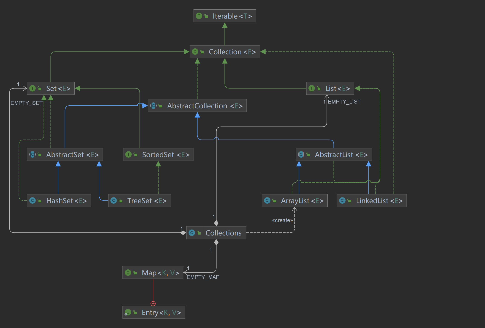

### Collection
```
The root interface in the collection hierarchy. A collection represents a group of objects, known as its elements.
Some collections allow duplicate elements and others do not. Some are ordered and others unordered.
```
依jdk注释所言，接口Collection是java集合体系中的根接口，是对一个数据集(一组物体)的抽象。该数据集不区分是否重复、是否有序等性质。
不同的方法提供了对数据集不同层面的抽象：

| 方法                              | 作用                        |
|---------------------------------|---------------------------|
| size()                          | 查看该集合有多少元素                |
| isEmpty()                       | 查看是否是空集合                  |
| contains(Object)                | 查看是否包含某一元素                |
| iterator()                      | 获取该集合的迭代器                 |
| toArray()                       | 将集合转换为数组形式                |
| add(<E>)                        | 为集合添加元素                   |
| remove(Object)                  | 将某一元素从集合中移除               |
| containsAll(Collection<?>)      | 查看是否包含某组元素                |
| addAll(Collection<? extends E>) | 为集合添加一组数据                 |
| removeAll(Collection<?>)        | 将一组元素从集合中移除               |
| retainAll(Collection<?>)        | 保留指定元素，即将原集合中不在指定集合里的数据删除 |
| clear()                         | 清空集合                      |

从java 1.8起，java引入Stream，Collection也加入了对Function、Stream的支持，添加了相应的方法

| 方法                             | 作用                 |
|--------------------------------|--------------------|
| removeIf(Predicate<? super E>) | 删除满足条件的元素          |
| spliterator()                  | 提供可并发执行的迭代器        |
| stream()                       | 将集合转换为Stream       |
| parallelStream()               | 将集合转换为可并发处理的Stream |

### List
```
An ordered collection (also known as a sequence).
The user of this interface has precise control over where in the list each element is inserted.
The user can access elements by their integer index (position in the list), and search for elements in the list.
```
List定位为有序的Collection，为用户提供精准的访问控制。
除了拥有Collection的语义外，还为某些性质添加了特有的表现，同时也增加了特有的性质：

| 方法                        | 作用                  |
|---------------------------|---------------------|
| add(element)              | 将元素追加到现有所有元素的后边     |
| addAll(index, collection) | 将元素插入到指定的开始位置       |
| get(index)                | 获取指定位置的元素           |
| set(index, element)       | 替换指定位置的元素           |
| add(index, element)       | 将元素插入到指定位置          |
| remove(index)             | 将指定元素删除             |
| indexOf(element)          | 获取元素在List中第一次出现的位置  |
| lastIndexOf(element)      | 获取元素最后一次出现的位置       |
| listIterator()            | 获取所有元素的ListIterator |
| listIterator(index)       | 获取指定位置之后的所有元素       |
| subList(from, to)         | 获取指定区间的所有元素         |

从java 1.8起，对Function、Stream等支持，提供了：

| 方法                           | 作用                                          |
|------------------------------|---------------------------------------------|
| replaceAll(UnaryOperator<e>) | 将元素依次映射为操作后的元素。即 e==>operator(e),亦即数学中的f(x) |
| sort(Comparator<? super E>)  | 按指定的比较器将所有元素进行排序                            |


### Set
```
A collection that contains no duplicate elements.
More formally, sets contain no pair of elements e1 and e2 such that e1.equals(e2), and at most one null element.
As implied by its name, this interface models the mathematical set abstraction.
```
Set定位为无重复元素的集合，可作为数学集合的抽象
保持了Collection的基本语义，没有新增特殊的方法

### Collections
Collections作为工具类提供了多种对Collection的操作，包括且不限于最大值、最小值、排序、逆序等操作。

### 关系

：

