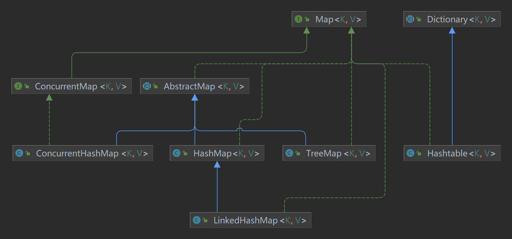

### Map
```
An object that maps keys to values. A map cannot contain duplicate keys; each key can map to at most one value.
This interface takes the place of the Dictionary class, which was a totally abstract class rather than an interface.
```
Map可理解为java对映射关系集的抽象，是对抽象类Dictionary的替换。Map管理k-v键值对(亦可理解为(x,f(x))对)，保证内部k无重复。
Map提供的方法有：

| 方法                   | 作用                     |
|----------------------|------------------------|
| size()               | 查看map中映射关系的数量          |
| isEmpty()            | 查看是否为空map              |
| containsKey(key)     | 查看(定义域)是否包含指定key       |
| containsValue(value) | 查看(值域)是否包含指定值          |
| get(key)             | 获取指定变量key对应的值          |
| put(key, value)      | 给map添加或更新映射关系key-value |
| remove(key)          | 从map中移除变量key对应的映射关系    |
| putAll(specificmap)  | 将指定map中的映射关系添加/更新至map中 |
| clear()              | 清空map                  |
| keySet()             | 获取map中的定义域(key的集合)     |
| values()             | 获取map中的值域(value的集合)    |
| entrySet()           | 获取关系对(k-v对)的集合         |

自java1.8添加function支持后，map添加新的方法：

| 方法                                 | 作用                                                     |
|------------------------------------|--------------------------------------------------------|
| getOrDefault(key, defaultValue)    | 获取key所对应的值，若为空则返回默认值                                   | 
| forEach(BiConsumer)                | 获取所有映射关系并依次执行指定操作                                      |
| replaceAll(BiFunction)             | 将所有映射关系中的值按指定函数进行重新计算并更新                               |
| putIfAbsent(key,value)             | 如果指定变量key未关联值，则将映射关系key-value添加入map                    |
| remove(key,value)                  | 若map中变量key的值为value，则将该映射关系删除                           |
| replace(key,oldValue,newValue)     | 若map中变量key的值为oldValue，则将其替换为newValue                   |
| replace(key,value)                 | 若map中存在变量为key的映射关系，则将其值替换为value                        |
| computeIfAbsent(key, Function f)   | 若map中不存在变量为key的映射关系，则添加key-f(key)映射关系                  |
| compueIfPresent(key, BiFunction f) | 若map中存在变量为key且值不为空的映射关系，则根据f(key, oldvalue)的值更新/删除映射关系 |
| compute(key, BiFunction f)         | 获取变量为key的映射关系，根据f(key, oldValue)进行重新映射                 |
| merge(key, value, BiFunction f)    | 将map中变量key所对应的值与指定非空value按f(oldValue,value)进行合并        |


### 附



