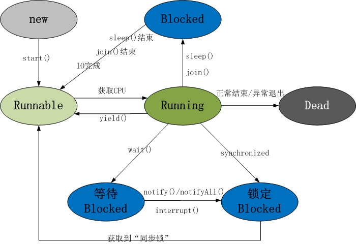

### 线程与进程
线程是操作系统最小的调度单位，进程是操作系统最小的资源分配单位。  
一个进程包含一个或多个线程，每个线程拥有独立的栈空间(java拥有独立的程序计数器PC),多个线程共享进程的堆空间  
java线程分工作线程与守护线程两类，所有工作线程结束任务后，进程退出。

### 线程的生命周期

  

线程共包括以下 5 种状态:
1. 新建状态(New): 线程对象被创建后，就进入了新建状态。例如，Thread thread = new Thread()。
2. 就绪状态(Runnable): 也被称为“可执行状态”。线程对象被创建后，其它线程调用了该对象的start()方法，从而来启动该线程。例如，thread.start()。处于就绪状态的线程，随时可能被CPU调度执行。
3. 运行状态(Running): 线程获取CPU权限进行执行。需要注意的是，线程只能从就绪状态进入到运行状态。
4. 阻塞状态(Blocked): 阻塞状态是线程因为某种原因放弃CPU使用权，暂时停止运行。直到线程进入就绪状态，才有机会转到运行状态。阻塞的情况分三种：  
   + 等待阻塞 -- 通过调用线程的wait()方法，让线程等待某工作的完成。
   + 同步阻塞 -- 线程在获取synchronized同步锁失败(因为锁被其它线程所占用)，它会进入同步阻塞状态。 
   + 其他阻塞 -- 通过调用线程的sleep()或join()或发出了I/O请求时，线程会进入到阻塞状态。当sleep()状态超时、join()等待线程终止或者超时、或者I/O处理完毕时，线程重新转入就绪状态。
5. 死亡状态(Dead): 线程执行完了或者因异常退出了run()方法，该线程结束生命周期。

#### 参考
+ [https://www.runoob.com/java/java-multithreading.html](https://www.runoob.com/java/java-multithreading.html)
